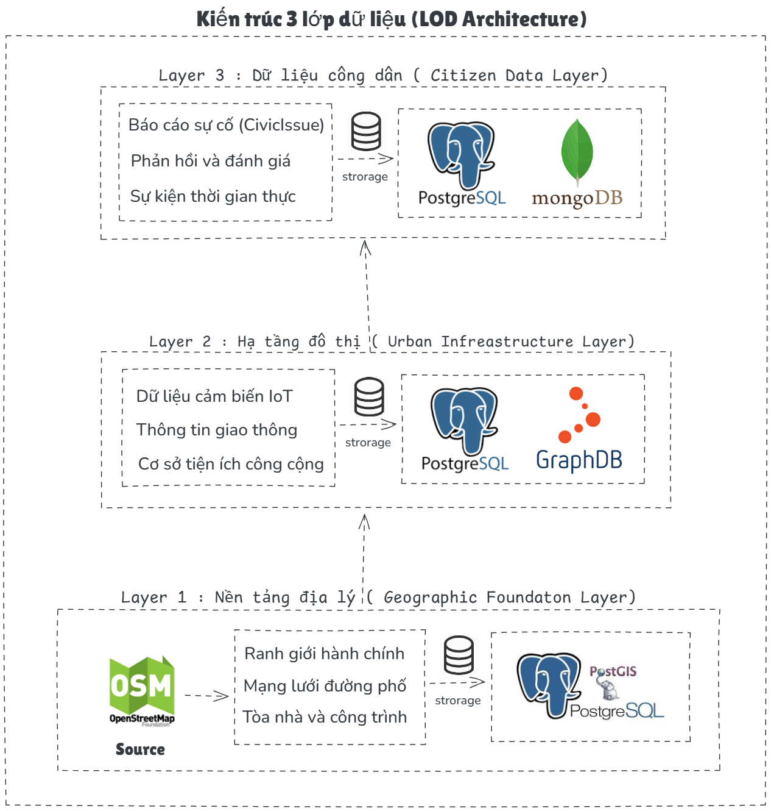

<p align="center">
  
</p>

<h1 align="center">CityLens</h1>

<p align="center">
  <strong>Nền tảng Thành phố Thông minh với Linked Open Data</strong>
</p>

<p align="center">
  <a href="https://www.gnu.org/licenses/gpl-3.0">
    
  </a>
  <a href="https://github.com/PKA-Open-Dynamics/CityLens">
    
  </a>
  <a href="https://www.npmjs.com/org/pka_opendynamics_2025">
    
  </a>
</p>

---

## Mục lục

- [Ý tưởng bài toán](#ý-tưởng-bài-toán)
- [Giải pháp kỹ thuật](#giải-pháp-kỹ-thuật)
- [Kiến trúc hệ thống](#kiến-trúc-hệ-thống)
- [Tính năng chính](#tính-năng-chính)
- [Đóng góp nguồn dữ liệu mở](#đóng-góp-nguồn-dữ-liệu-mở)
- [NPM Packages](#npm-packages)
- [Cấu trúc dự án](#cấu-trúc-dự-án)
- [Công nghệ](#công-nghệ)
- [Cài đặt](#cài-đặt)
- [Tài liệu](#tài-liệu)
- [Giấy phép](#giấy-phép)

---

## Ý tưởng bài toán

### Vấn đề cần giải quyết

Các thành phố lớn tại Việt Nam đang đối mặt với nhiều thách thức trong quản lý đô thị:

1. **Thiếu kênh tiếp nhận hiệu quả**: Người dân khó khăn trong việc báo cáo các vấn đề hạ tầng đô thị (đèn đường hỏng, đường xuống cấp, rác thải...)

2. **Dữ liệu phân tán**: Thông tin về chất lượng không khí, giao thông, thời tiết nằm rải rác ở nhiều nguồn, thiếu tích hợp

3. **Không có chuẩn dữ liệu thống nhất**: Các hệ thống hiện tại không tuân theo chuẩn mở, gây khó khăn cho việc liên thông dữ liệu

4. **Thiếu minh bạch**: Người dân không thể theo dõi tiến độ xử lý các vấn đề đã báo cáo

### Đối tượng người dùng

| Đối tượng | Nhu cầu |
|-----------|---------|
| Công dân | Báo cáo sự cố, theo dõi tiến độ xử lý |
| Cơ quan quản lý | Tiếp nhận, phân loại và xử lý báo cáo |
| Nhà hoạch định | Phân tích dữ liệu đô thị để ra quyết định |
| Nhà phát triển | Truy cập API mở để xây dựng ứng dụng |

---

## Giải pháp kỹ thuật

### Tổng quan giải pháp

CityLens là nền tảng thành phố thông minh sử dụng kiến trúc Linked Open Data (LOD) 3 lớp, tuân thủ các chuẩn quốc tế NGSI-LD, SOSA/SSN và FiWARE Smart Data Models.

### Mạng dữ liệu LOD Cloud

Dự án tạo ra một **LOD Cloud** (Linked Open Data Cloud) cho dữ liệu đô thị Hà Nội với các đặc điểm:

- **Chuẩn hóa dữ liệu**: Tất cả dữ liệu được mô hình hóa theo ontology chuẩn (NGSI-LD, SOSA/SSN, GeoSPARQL)
- **Liên kết dữ liệu rời rạc**: Tích hợp và liên kết các nguồn dữ liệu độc lập:
  - OpenStreetMap (ranh giới, POIs)
  - AQICN (chất lượng không khí)
  - OpenWeatherMap (thời tiết)
  - TomTom (giao thông)
  - Civic Issues (báo cáo công dân)
- **Tăng tính hữu dụng**: Dữ liệu liên kết cho phép:
  - Truy vấn SPARQL phức tạp trên nhiều domain
  - Phát hiện mối quan hệ ẩn giữa các sự kiện đô thị
  - Tái sử dụng dữ liệu cho các ứng dụng khác
  - Mở rộng dễ dàng với nguồn dữ liệu mới

### Cách tiếp cận

<p align="center">
  
</p>

### Điểm nổi bật của giải pháp

| Đặc điểm | Mô tả |
|----------|-------|
| **NGSI-LD Compliant** | API tuân thủ chuẩn ETSI NGSI-LD, tương thích với hệ sinh thái FiWARE |
| **Linked Open Data** | Dữ liệu liên kết với ontology chuẩn, có thể truy vấn SPARQL |
| **Spatial-enabled** | Tích hợp PostGIS cho các truy vấn không gian địa lý |
| **Real-time** | Cập nhật dữ liệu thời gian thực qua WebSocket |
| **Open Source** | Toàn bộ mã nguồn mở theo giấy phép GPL-3.0 |

---

## Kiến trúc hệ thống

### Kiến trúc 3 lớp dữ liệu (LOD Architecture)

<p align="center">
  
</p>

### Ontology và Data Models

CityLens sử dụng ontology tùy chỉnh kết hợp với các ontology chuẩn:

| Ontology | Mục đích | Namespace |
|----------|----------|-----------|
| CityLens Ontology | Định nghĩa riêng cho báo cáo công dân | `citylens:` |
| SOSA/SSN | Mô hình hóa cảm biến và quan sát | `sosa:` |
| GeoSPARQL | Dữ liệu không gian địa lý | `geo:` |
| Smart Data Models | Data models cho Smart City | `sdm:` |

---

## Tính năng chính

### Cho Công dân

- Báo cáo sự cố với hình ảnh và định vị GPS
- Theo dõi trạng thái xử lý báo cáo
- Xem bản đồ các vấn đề đô thị
- Nhận thông báo cập nhật

### Cho Cơ quan quản lý

- Dashboard quản lý báo cáo tập trung
- Phân loại và gán xử lý tự động
- Thống kê và báo cáo
- Quản lý người dùng và phân quyền

### Dữ liệu đô thị tích hợp

- Chất lượng không khí thời gian thực (AQI)
- Thông tin giao thông và tắc đường
- Dữ liệu thời tiết
- Ranh giới hành chính từ OpenStreetMap

---

## Đóng góp nguồn dữ liệu mở

### Dữ liệu đã xây dựng

| Loại dữ liệu | Mô tả | Số lượng | Định dạng |
|--------------|-------|----------|-----------|
| Ranh giới hành chính Hà Nội | 30 quận/huyện, 579 phường/xã | 609 entities | GeoJSON, PostGIS |
| Dữ liệu OSM Hà Nội | Buildings, Roads, POIs | 487,000+ entities | PostgreSQL + PostGIS |
| Danh mục báo cáo | Vấn đề hạ tầng đô thị | 28 categories | JSON |
| Ontology CityLens | Định nghĩa lớp và thuộc tính | Custom ontology | OWL, Turtle, RDF/XML |
| Context NGSI-LD | JSON-LD context cho entities | ETSI compliant | JSON-LD |

### NPM Packages đóng góp

Dự án phát hành 3 thư viện npm mã nguồn mở theo chuẩn TypeScript:

| Package | Version | Mô tả | Downloads |
|---------|---------|-------|-----------|
| `@pka_opendynamics_2025/citylens-utils` | 1.0.0 | Tiện ích xử lý dữ liệu đô thị | [npm](https://www.npmjs.com/package/@pka_opendynamics_2025/citylens-utils) |
| `@pka_opendynamics_2025/citylens-geo-utils` | 1.0.0 | Xử lý dữ liệu địa lý và GeoJSON | [npm](https://www.npmjs.com/package/@pka_opendynamics_2025/citylens-geo-utils) |
| `@pka_opendynamics_2025/citylens-ngsi-ld` | 1.0.0 | Xây dựng NGSI-LD entities | [npm](https://www.npmjs.com/package/@pka_opendynamics_2025/citylens-ngsi-ld) |

### Nguồn dữ liệu tích hợp

| Nguồn | Loại dữ liệu | Cập nhật | Định dạng |
|-------|--------------|----------|-----------|
| OpenStreetMap | Bản đồ nền, ranh giới, POIs | On-demand | GeoJSON, PostGIS |
| AQICN | Chất lượng không khí (PM2.5, PM10, AQI) | Real-time | REST API |
| OpenWeatherMap | Thời tiết, nhiệt độ, độ ẩm | Real-time | REST API |
| TomTom | Giao thông, tắc đường | Real-time | Traffic API |

---

## Cấu trúc dự án

```
CityLens/
│
├── backend/                           # FastAPI Backend - LOD Architecture
│   ├── app/
│   │   ├── api/v1/                   # REST API endpoints (NGSI-LD compliant)
│   │   ├── core/                     # Config, database, security
│   │   ├── db/                       # Multi-database: PostgreSQL, MongoDB, GraphDB, Redis
│   │   ├── models/                   # SQLAlchemy ORM models
│   │   ├── schemas/                  # Pydantic validation schemas
│   │   ├── repositories/             # Data access layer
│   │   ├── services/                 # Business logic
│   │   └── adapters/                 # External APIs (AQICN, OpenWeather, TomTom)
│   ├── scripts/
│   │   ├── init_db.py                # Database initialization
│   │   └── import_osm.py             # OSM import (487k+ entities)
│   └── start.sh                      # Quick start script
│
├── web-dashboard/                     # Next.js 14 Admin Dashboard
│   ├── src/
│   │   ├── app/                      # App Router (Next.js 14)
│   │   │   ├── (dashboard)/          # Protected routes
│   │   │   ├── login/                # Authentication
│   │   │   └── signup/               # Registration
│   │   ├── components/
│   │   │   ├── layout/               # Sidebar, Header
│   │   │   ├── ui/                   # Reusable UI components
│   │   │   └── providers/            # Auth & Theme providers
│   │   └── lib/                      # API client, utilities
│   └── netlify.toml                  # Netlify deployment config
│
├── web-app/                           # React Native + Expo (Mobile & Web)
│   ├── src/
│   │   ├── screens/                  # App screens
│   │   │   ├── LoginScreen.tsx       # User authentication
│   │   │   ├── MapScreen.native.tsx  # Interactive map
│   │   │   ├── CreateReportScreen.native.tsx  # Civic issue reporting
│   │   │   ├── ExploreScreen.native.tsx       # Data exploration
│   │   │   └── ProfileScreen.native.tsx       # User profile
│   │   ├── components/               # Reusable components
│   │   ├── navigation/               # React Navigation setup
│   │   ├── contexts/                 # Auth context
│   │   └── services/                 # API services
│   └── app.json                      # Expo configuration
│
├── packages/                          # NPM Packages (TypeScript)
│   ├── citylens-utils/               # Urban data utilities
│   ├── citylens-geo-utils/           # GeoJSON & spatial operations
│   └── citylens-ngsi-ld/             # NGSI-LD entity builders
│
├── docs/                              # Documentation & Assets
│   └── assets/architecture/          # Architecture diagrams
│   └── assets/video_demo/          # Video Demo for clone & run
│
├── docker-compose.yml                 # Development environment
├── README.md                          # This file
├── CHANGELOG.md                       # Version history
├── CONTRIBUTING.md                    # Contribution guidelines
└── LICENSE                            # GPL-3.0 License
```

---

## Công nghệ sử dụng

### Backend Stack

| Thành phần | Công nghệ | Phiên bản |
|------------|-----------|-----------|
| **Web Framework** | FastAPI | 0.109.0 |
| **Database** | PostgreSQL + PostGIS | 15+ |
| **Graph Database** | Apache Jena Fuseki | 4.x |
| **Document Store** | MongoDB | 7+ |
| **Cache** | Redis | 7+ |
| **ORM** | SQLAlchemy | 2.0+ |
| **Validation** | Pydantic | 2.0+ |
| **Standards** | NGSI-LD, SOSA/SSN | ETSI v1.8.1 |

### Web Dashboard Stack

| Thành phần | Công nghệ | Phiên bản |
|------------|-----------|-----------|
| **Framework** | Next.js (App Router) | 14.2.33 |
| **Language** | TypeScript | 5.6+ |
| **Styling** | Tailwind CSS | 3.4+ |
| **Maps** | Leaflet | 1.9+ |
| **Deployment** | Netlify | Static Export |

### Web App Stack (Mobile & Web)

| Thành phần | Công nghệ | Phiên bản |
|------------|-----------|-----------|
| **Framework** | React Native + Expo | 0.81 / 54 |
| **Language** | TypeScript | 5.9+ |
| **Navigation** | React Navigation | 7.x |
| **Maps** | React Native Maps | 1.20+ |
| **Platform** | iOS, Android, Web | Cross-platform |

### NPM Packages

| Package | Version | TypeScript | npm |
|---------|---------|------------|-----|
| citylens-utils | 1.0.0 | Yes | Published |
| citylens-geo-utils | 1.0.0 | Yes | Published |
| citylens-ngsi-ld | 1.0.0 | Yes | Published |

---

## Cài đặt

### Yêu cầu hệ thống

| Thành phần | Phiên bản tối thiểu | Khuyến nghị |
|------------|---------------------|-------------|
| **Python** | 3.11+ | 3.11.9 |
| **Node.js** | 20+ | 20.18.1 LTS |
| **npm** | 10+ | 10.9.0 |
| **PostgreSQL** | 15+ | 15.10 |
| **PostGIS** | 3.4+ | 3.4.3 |
| **Redis** | 7+ | 7.4.1 (tùy chọn) |
| **Docker** | 24+ | 27.3.1 (tùy chọn) |
| **Git** | 2.40+ | Latest |

### Hệ điều hành hỗ trợ

- macOS 12+ (Monterey hoặc mới hơn)
- Ubuntu 22.04 LTS hoặc mới hơn
- Windows 11 với WSL2

> **Lưu ý**: Mỗi sub-project có hướng dẫn cài đặt chi tiết riêng:
> - Backend: Xem [backend/README.md](backend/README.md) - Hướng dẫn cài đặt Python environment, PostgreSQL, và import 487k+ OSM entities
> - Web Dashboard: Xem [web-dashboard/README.md](web-dashboard/README.md) - Setup Next.js 14, Tailwind CSS, và Netlify deployment
> - Web App: Xem [web-app/README.md](web-app/README.md) - Cài đặt React Native, Expo, và chạy trên iOS/Android/Web

### Backend

### Backend

```bash
cd backend
chmod +x setup.sh
./setup.sh
```

### Web Dashboard

```bash
cd web-dashboard
chmod +x setup.sh
./setup.sh
```

### Web App (React Native + Expo)

```bash
cd web-app
chmod +x scripts/setup.sh
./scripts/setup.sh
```

### Docker (Development)

```bash
docker-compose up -d
```

---

## Tài liệu

### Tài liệu chính

- [CHANGELOG.md](CHANGELOG.md) - Lịch sử phiên bản
- [CONTRIBUTING.md](CONTRIBUTING.md) - Hướng dẫn đóng góp
- [CODE_OF_CONDUCT.md](CODE_OF_CONDUCT.md) - Quy tắc cộng đồng

### Tài liệu Sub-projects

- Backend: [README](backend/README.md) | [DEPENDENCIES](backend/DEPENDENCIES.md) | [DATABASE_IMPORT](backend/DATABASE_IMPORT.md)
- Web Dashboard: [README](web-dashboard/README.md) | [DEPENDENCIES](web-dashboard/DEPENDENCIES.md)
- Web App: [README](web-app/README.md) | [DEPENDENCIES](web-app/DEPENDENCIES.md)

### NPM Packages

- [citylens-utils](packages/citylens-utils/README.md) - Urban data utilities
- [citylens-geo-utils](packages/citylens-geo-utils/README.md) - GeoJSON operations
- [citylens-ngsi-ld](packages/citylens-ngsi-ld/README.md) - NGSI-LD builders

### API Documentation

- Swagger UI: http://localhost:8000/api/v1/docs
- ReDoc: http://localhost:8000/api/v1/redoc

---

## Đóng góp

Chúng tôi hoan nghênh mọi đóng góp từ cộng đồng! Vui lòng đọc [CONTRIBUTING.md](CONTRIBUTING.md) và [CODE_OF_CONDUCT.md](CODE_OF_CONDUCT.md) trước khi bắt đầu.

---

## Giấy phép

Dự án này được phát hành dưới giấy phép **GNU General Public License v3.0 (GPL-3.0)**.

```
Copyright (c) 2025 CityLens Contributors

This program is free software: you can redistribute it and/or modify
it under the terms of the GNU General Public License as published by
the Free Software Foundation, either version 3 of the License, or
(at your option) any later version.
```

Xem file [LICENSE](LICENSE) để biết chi tiết.

---

## Liên hệ

| Kênh | Liên kết |
|------|----------|
| Bug Reports | [GitHub Issues](https://github.com/PKA-Open-Dynamics/CityLens/issues) |
| Discussions | [GitHub Discussions](https://github.com/PKA-Open-Dynamics/CityLens/discussions) |
| Repository | https://github.com/PKA-Open-Dynamics/CityLens |

---

## Tác giả

**CityLens Contributors** - Team PKA Open Dynamics

---

<p align="center">
  <strong>CityLens</strong> - Smart City Platform with Linked Open Data<br>
</p>
